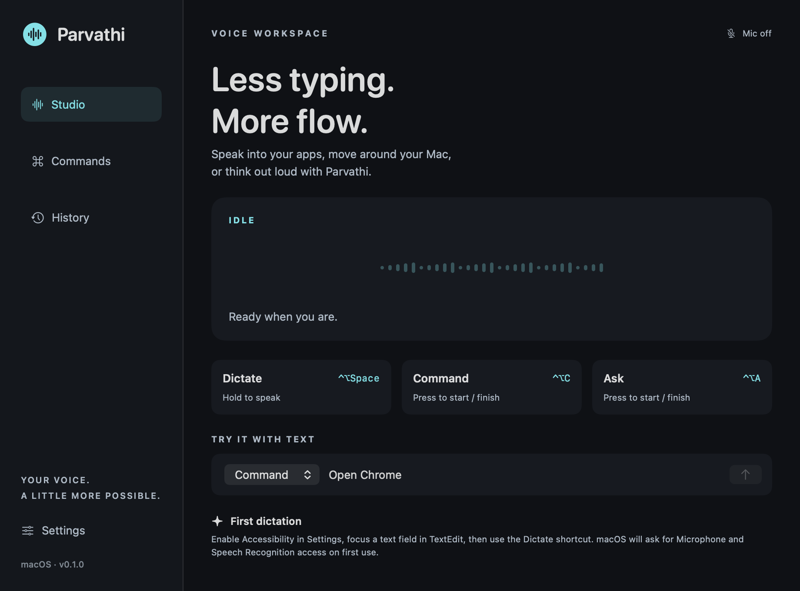

# Parvathi

A native voice assistant for **Windows and macOS**: dictate into other applications, run a small set of computer commands, and ask questions with spoken replies. The Windows application uses C#/WPF and offline Vosk recognition. The preserved macOS application uses SwiftUI/AppKit, Apple Speech, Accessibility, CoreAudio, and Keychain, with no third-party Swift dependencies.

**The mode is a contract:** saying “open Chrome” in Dictation inserts text. The same phrase in Command mode opens or focuses the installed application. Model output never becomes an executable command.

## Download for Windows 11 x64

**[Windows release and downloads](https://github.com/KrishnaVarun02/Parvathi/releases/tag/v0.2.0-windows.1)**

| Download | Use |
| --- | --- |
| [Parvathi Windows installer](https://github.com/KrishnaVarun02/Parvathi/releases/download/v0.2.0-windows.1/Parvathi-Setup-0.2.0-win-x64.exe) | Double-click, install for your user, then open Parvathi from Start |
| [Portable ZIP](https://github.com/KrishnaVarun02/Parvathi/releases/download/v0.2.0-windows.1/Parvathi-0.2.0-win-x64-portable.zip) | Extract the complete folder and run `Parvathi.exe` |
| [SHA-256 checksums](https://github.com/KrishnaVarun02/Parvathi/releases/download/v0.2.0-windows.1/SHA256SUMS.txt) | Compare the downloaded files with the published hashes |

The repository is private: sign in to a GitHub account with repository access to download. This is an **unsigned Windows prerelease**; Windows may show an unknown-publisher or SmartScreen warning. Check the release source and checksums; Parvathi does not require Windows security to be disabled.

The Windows downloads include the .NET runtime and native recognition libraries. End users do not need an SDK, Visual Studio, Python, Node.js, Git, or a development server. On first use, click **Download / repair model** in Settings for the 41,205,931-byte offline model. Choose your microphone, focus an editable Notepad field, hold **Ctrl+Alt+Space**, speak, and release. Keep the destination unchanged until the result appears. **Ctrl+Alt+C** starts/finishes a command; **Ctrl+Alt+A** starts/finishes a question; **Escape** stops active work.

Verbatim dictation and computer commands need no paid AI key. Polished text, Ask, Rewrite, and Explain require a configured OpenAI account or a separately running Ollama model. Self-contained packaging does not make optional cloud AI offline.

See **[Windows setup, privacy, architecture, troubleshooting, and acceptance checklist](docs/WINDOWS.md)** and the **[updated interview guide](docs/Parvathi-Interview-Guide.pdf)**. Live Windows microphone, cross-application, and authenticated-provider checks remain explicitly unverified; compiled code and CI tests are not a substitute for those checks.

The sections below describe the macOS application; Windows commands and platform-specific behavior are documented in the Windows guide.



*Native SwiftUI view render. Interaction verification is recorded separately below.*

## macOS: get running

Requirements: macOS 14+, Apple Command Line Tools with Swift 6.0 or later, and a microphone. Development used Apple Silicon, macOS 26.6, and Swift 6.4 in Swift 5 language mode. The package builds for the current architecture; cross-architecture and older-OS runtime validation remain release work.

```sh
xcode-select --install  # if the tools are not installed
cd Parvathi
swift build
./scripts/test.sh
./script/build_and_run.sh
```

The run script packages and opens `dist/Parvathi.app`. Use the application bundle for interactive testing: its `Info.plist` supplies the microphone and speech permission descriptions. A command-line `swift run` launch is not the recommended permission flow. The development run script stops an existing process named Parvathi before relaunching.

1. Open Parvathi Settings → Voice → Enable Accessibility. Allow the app in System Settings → Privacy & Security → Accessibility.
2. Request speech access in Settings, or begin a recording. Allow Microphone and Speech Recognition. If macOS requests it, quit and reopen the app after granting permission.
3. Choose the microphone through System Settings → Sound → Input. Parvathi follows the default input.
4. Focus an editable TextEdit document, hold **Control-Option-Space**, speak a paragraph, and release.
5. Keep the same app, field, cursor, and selection focused until insertion completes. Read the verification feedback.

On-device recognition is enabled by default. If the selected locale has no available on-device recognizer, choose another locale or explicitly disable that setting to allow Apple server recognition. Parvathi does not silently make that privacy change.

## Controls

| Interaction | Default control | Behavior |
| --- | --- | --- |
| Dictation | Hold Control-Option-Space | Release to finish and insert |
| Hands-free dictation | Enable in Settings; same shortcut | Press to start; press again to finish |
| Command | Control-Option-C | Press to start; press again to finish |
| Ask Parvathi | Control-Option-A | Press to start; press again to finish |
| Rewrite selection | Menu bar → Rewrite selection | Select text first, speak an editing instruction, then Finish |
| Explain selection | Menu bar → Explain selection | Select text first, ask about it, then Finish |
| Stop | Escape or Stop button | Cancel recording, pending request, or speech |

Settings offers supported key choices and Control-Option or Command-Shift modifiers. Click **Apply shortcuts** after changing them. Conflicts produce an error rather than silently claiming a shortcut works. Escape monitoring is active only while a request is active.

The menu bar keeps the app available after its dashboard closes. The floating panel shows microphone activity, transcript, state, and feedback. The Studio text composer also exercises real Command and Ask paths; it does not fabricate a voice recording. `Type:` from that composer cannot insert into another app because it has no captured destination. Use the voice Command shortcut with a focused text field for typing.

## Supported commands

| Say in Command mode | Result |
| --- | --- |
| “Open Chrome.” | Resolve the actual installed app and open/focus it |
| “Switch to Visual Studio Code.” | Open/focus that installed app |
| “Open website https://example.com” | Send the HTTP(S) URL to the default browser |
| “Search the web for vegetarian dinner recipes” | Open a Google search in the default browser |
| “Set the volume to 30 percent.” | Set default output volume and read it back |
| “Mute” / “Unmute” | Change default output mute and read it back |
| “Type: I'll join the meeting in five minutes.” | Insert into the captured text field |

The command library is searchable. Application discovery reads standard application folders and running apps. Exact names and bundle IDs, known aliases, prefixes, and substrings are resolved in that order. Ambiguous names produce a short clarification with possible matches; say the full name in a new request. This is not an open-ended natural-language planner.

One action is supported per request. Unsupported or chained commands are rejected. Browser opening is reported as **unverified** for page loading: the app does not fetch or read the page. The conversational assistant has no live retrieval and is instructed to acknowledge that limit.

## Optional AI provider

Verbatim dictation and computer commands do **not** require an AI key. Polished dictation, Ask, Rewrite, and Explain do.

In Settings → Provider:

| Provider | Base URL | Model | Credential |
| --- | --- | --- | --- |
| OpenAI | `https://api.openai.com/v1` | Configurable; initial value `gpt-6-astra` | Save your API key in the Keychain control |
| Ollama | `http://localhost:11434` | A model installed in your Ollama server | None; authenticated remote Ollama is not supported |

Choose a model available to your provider/account. Ollama must be running and its model installed separately. Switching the provider updates the suggested endpoint; enter the desired model and check the endpoint before use.

`.env.example` documents the configuration without secrets. **The app does not load `.env` files or environment API keys.** Credentials entered in the app are saved to macOS Keychain and are never put in UserDefaults or source control. The saved key is used only for OpenAI and is not forwarded to Ollama. Remove or replace it when changing OpenAI credentials or a compatible endpoint.

Polished mode requests filler-word removal and punctuation while preserving names, numbers, and meaning. Generated edits can still be wrong; review important text. “Verbatim” means the recognized words without AI rewriting, not a guarantee of perfect or disfluency-preserving recognition.

## Privacy and execution boundaries

- **Microphone:** active only during a visible recording session. Live buffers stay in memory; Parvathi does not retain raw audio. Recording is capped at 55 seconds.
- **Recognition:** on-device-only by default. Turning this off allows Apple Speech to use Apple servers.
- **Reasoning:** the configured provider receives the requested prompt, bounded recent conversation, polished transcript, or explicitly selected text. It does not receive audio or screenshots. Local Ollama uses loopback HTTP; a configured remote service receives that text remotely.
- **Network:** remote provider endpoints require HTTPS. Requests use ephemeral sessions, have timeouts, and refuse redirects. OpenAI requests set `store: false`; this is not a promise of zero provider retention. Provider policies and account settings still apply.
- **History:** off by default. If enabled, the latest 100 completed requests are stored in `~/Library/Application Support/Parvathi/history.json` with restricted permissions. The file is not encrypted by the app. Turning history off or choosing Delete history & clear conversation removes the local file.
- **Conversation:** current-session text is held in memory and bounded. Clear session removes it. Metadata-only pipeline logging does not intentionally log transcripts, audio, keys, or selected document content.
- **Trust:** selected text is untrusted reference content. AI outputs cannot call the OS executor. There are no tools for arbitrary shell commands, messaging, deletion, purchases, or sensitive settings.

Focus capture briefly reads the original field value and selection into memory to verify a safe insertion point. Secure/password fields are rejected. Before insertion the app checks process, field, selection, existing text, and application activation changes. It refuses to type after those change.

Accessibility insertion is preferred. Clipboard fallback snapshots all readable representations, targets the captured process, and restores its clipboard snapshot only while Parvathi still owns the clipboard change count. If the user copies something new while insertion is pending, the newer clipboard content wins. Unsupported/lazy representations can cause a safe refusal.

Cancellation invalidates the request, cancels asynchronous work, and stops speech. It cannot undo an edit, volume change, browser request, or application launch already sent to macOS. There is no automatic retry after dispatch. Duplicate protection is per active request, not a persistent exactly-once guarantee across process crashes.

## Architecture and source map

```text
Sources/
  ParvathiCore/       Mode/command routing, typed actions, app resolution, RequestGate
  Parvathi/
    App/             SwiftUI application, menu bar, app delegate
    Stores/          Controller, preferences, opt-in local history
    Services/        Speech, AI, Keychain, shortcuts, focus/clipboard, OS actions
    Views/           Dashboard, floating voice panel, settings
Tests/               Core and service tests
Resources/Info.plist Application identity and permission descriptions
script/              Build-and-run entry point
scripts/             Packaging and interview PDF generator
docs/                Architecture, manual checklist, interview guide
```

Native SwiftUI/AppKit fits the current Mac and avoids a web runtime between the app and its most important APIs. `AIProvider`, `SpeechRecognizing`, `SpeechSynthesizing`, and `SystemAutomating` define replaceable contracts. Recognition and speech output support controller constructor injection; platform defaults implement the contracts. Focus insertion remains an isolated native service. See [Architecture](docs/ARCHITECTURE.md) and the [Interview Guide](docs/Parvathi-Interview-Guide.pdf).

## Build, package, and diagnose

```sh
swift build                         # compile
./scripts/test.sh                   # automated core/service checks
./script/build_and_run.sh            # package debug bundle and launch
./script/build_and_run.sh --debug    # LLDB
./script/build_and_run.sh --logs     # process log stream
./script/build_and_run.sh --telemetry # pipeline metadata log stream
./script/build_and_run.sh --verify   # launch/process-presence smoke check
./scripts/package.sh                 # release app + ZIP in dist/
./scripts/package.sh debug           # debug app bundle
```

The test script wraps `swift test` with Swift Testing framework paths for standalone Command Line Tools and disables the unused XCTest runner. Plain `swift test` can fail when that toolchain omits XCTest. With full Xcode, the extra framework override is unnecessary. The script uses local compiler caches; set `PARVATHI_DISABLE_SWIFTPM_SANDBOX=1` only if an enclosing development sandbox prevents SwiftPM's nested sandbox.

The package script signs ad hoc unless `SIGNING_IDENTITY` is set. Ad-hoc signing is for local development; Developer ID signing, hardened runtime review, notarization, and architecture compatibility testing are still needed for broader distribution. Rebuilding with a changed signing identity can require permissions to be granted again.

If compilation is running in a restricted environment, point module caches to a writable location or use the environment's approved build setup. Normal local development should use the commands above.

To regenerate the guide independently:

```sh
python3 -m venv .venv-docs
.venv-docs/bin/pip install -r requirements-docs.txt
.venv-docs/bin/python scripts/build_interview_pdf.py
pdftoppm -png docs/Parvathi-Interview-Guide.pdf /tmp/parvathi-guide
```

The PDF generator is deterministic apart from PDF metadata and uses ReportLab's built-in fonts. These Python dependencies are documentation-only, not app runtime dependencies.

## Verification and remaining limitations

Build checks and automated routing, validation, request-ownership, and service tests are separate from live acceptance evidence. On the development machine, the full app and tests compiled and 33 tests across five suites passed. Native launch diagnostics observed the packaged app process and window metadata; the native dashboard render was visually inspected. A direct native Chrome activation request resolved the real running process but correctly reported **unverified** because macOS's foreground app remained `loginwindow` in this session. Confirm foreground activation in an unlocked session. These results do not establish the complete voice path. Follow [Manual verification](docs/MANUAL_VERIFICATION.md) for real microphone transcription, insertion into other apps, permission prompts, clipboard fallback, Escape, and live provider behavior.

Current limitations:

- The macOS build still needs distribution and older-supported-OS validation. Windows 11 x64 is a separate native prerelease; ARM64 Windows and live Windows acceptance testing remain pending.
- Apple Speech availability and accuracy vary by locale, device, and service. Each session is bounded.
- Strict Accessibility checks intentionally exclude editors that hide field values or selected ranges; remote desktops and custom controls may be incompatible.
- Input device selection uses macOS Settings, rather than per-app routing.
- The grammar is English and intentionally narrow. Ambiguity is resolved by recording a new, more specific command.
- Some HDMI, USB, Bluetooth, or hardware-managed outputs do not expose software volume/mute controls.
- No wake word, screen capture, live answer retrieval, multi-step plans, or sensitive actions.
- AI response quality and latency depend on the configured provider; generated edits should be reviewed.
- No durable transaction log, crash recovery, or universal exactly-once delivery for native effects.

Future work should first expand observed editor coverage and injected service testing, then add bounded multi-step plans. Any future messaging, deletion, purchase, or sensitive-setting action must show a concrete preview and require explicit confirmation before dispatch. Screen understanding should be explicit and visible, with captured content treated as data rather than authority.

## Official references

- [Apple Speech audio buffers](https://developer.apple.com/documentation/speech/sfspeechaudiobufferrecognitionrequest)
- [Apple on-device recognition](https://developer.apple.com/documentation/speech/sfspeechrecognitionrequest/requiresondevicerecognition)
- [Apple Accessibility](https://developer.apple.com/documentation/applicationservices/axuielement)
- [Apple NSWorkspace](https://developer.apple.com/documentation/appkit/nsworkspace)
- [Apple Keychain services](https://developer.apple.com/documentation/security/keychain-services)
- [OpenAI text generation](https://developers.openai.com/api/docs/guides/text)
- [OpenAI Responses and storage](https://developers.openai.com/api/docs/guides/migrate-to-responses)
- [Ollama chat API](https://docs.ollama.com/api/chat)
