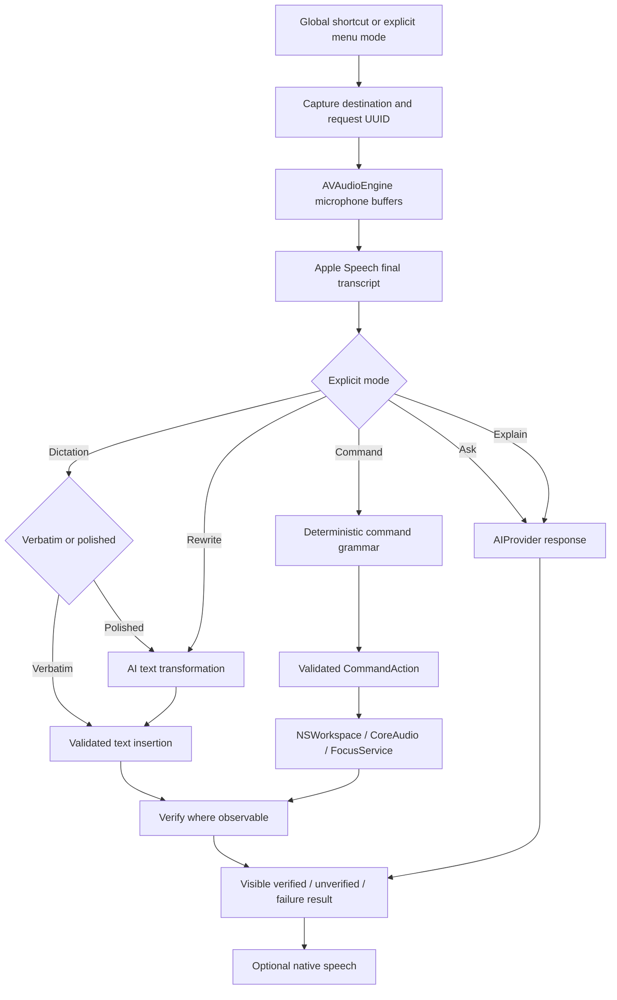

# macOS architecture

This document describes the original macOS application. See [Windows architecture and distribution](WINDOWS.md) for the separate C#/WPF application and its release pipeline.

Parvathi is a native macOS application with a testable core and narrow operating-system service boundaries. Its central rule is that a mode chosen by the user determines how the transcript is interpreted.

## Pipeline

Every suspension point in the controller is followed by a request-ownership check. Escape invalidates the request, cancels work, and stops speech. It cannot roll back a dispatched operating-system effect.

## Components

| Component | Responsibility | Boundary |
| --- | --- | --- |
| `AssistantController` | Coordinate one request, UI phase, session context | Main actor |
| `ModeRouter` | Preserve the explicit mode | Pure routing |
| `CommandRouter` | Parse known phrases and validate arguments | Transcript → typed enum |
| `ApplicationResolver` | Resolve discovered app names and ambiguity | Catalog → one installed app |
| `RequestGate` | Own request UUID and one action claim | Main actor, no OS effects |
| `SpeechRecognitionService` | Permissions, live capture, final transcription | AVAudioEngine / Apple Speech |
| `AIProvider` / `HTTPAIProvider` | Answer or transform text | Text-only HTTP requests |
| `SpeechOutput` | Speak and stop a response | AVSpeechSynthesizer |
| `FocusService` | Capture, validate, insert, preserve clipboard | Accessibility / pasteboard / targeted key events |
| `SystemAutomation` | Discover apps, execute supported actions, verify | NSWorkspace / CoreAudio |
| `KeychainStore` | Save/read/delete secrets | Security framework |
| `GlobalShortcuts` | Global registered shortcuts and active Escape | Carbon / NSEvent |

`ParvathiCore` has no GUI or microphone dependency. Its rules can run under unit tests without permissions or credentials. The app target contains the actual platform integrations. `AIProvider`, `SpeechRecognizing`, `SpeechSynthesizing`, and `SystemAutomating` are explicit service protocols. The controller accepts recognition and speech implementations in its initializer, while native defaults satisfy those contracts. Automation is protocol-typed with a native default. Focus insertion remains a concrete, isolated service; fuller constructor injection would improve end-to-end fixture testing.

## Request ownership and cancellation

`RequestGate.begin()` creates a UUID and makes it current. `check(id)` rejects stale IDs and canceled tasks. `claimAction(id)` runs immediately before a side effect and can succeed once per request. `finish(id)` ignores stale completions so an older request cannot end a newer one. Starting another request cancels the prior pipeline.

This provides at-most-one action claim during a running request. It does not provide durable exactly-once execution across crashes. The executor never automatically retries a possibly dispatched action. A user must inspect an unverified result before issuing a new request.

Native APIs differ in cancellation support. URLSession responds to Swift task cancellation. Speech capture and synthesis expose stop/cancel operations. NSWorkspace application launch has no cancel API; Parvathi requests background launch and only activates after its cancellable wait succeeds. A process might still appear after cancellation, but a late callback does not deliberately focus it.

## Speech and phases

UI states are idle, listening, transcribing, thinking, executing, and speaking. The microphone-active indicator corresponds to recording; waveform levels derive from the actual audio buffer signal. The input follows macOS's selected default device.

Speech buffers exist in memory and are appended directly to `SFSpeechAudioBufferRecognitionRequest`. On-device recognition is required by default and checked before recording. Disabling that requirement explicitly permits Apple's remote recognition path. Verbatim avoids AI rewriting; the speech recognizer itself can still normalize words or omit disfluencies.

| Operation | Bound |
| --- | --- |
| Recording session | 55 seconds |
| Final recognition wait | 4 seconds |
| AI request / total resource | 30 / 45 seconds |
| Application launch wait | 10 seconds |
| Foreground activation verification | 2 seconds |
| Text insertion verification | 1 second |
| Accessibility message timeout | 0.2 seconds |
| Spoken response watchdog | 60 seconds |

Permission prompts are system-controlled and can outlive the user's canceled pipeline; cancellation prevents subsequent application work from executing. The app uses request IDs to discard late callbacks.

## Focus and clipboard safety

A focus snapshot records the process ID, Accessibility element, original field value, selected UTF-16 range, and application activation revision. Capture happens before showing UI or permission prompts. Password and protected fields are rejected.

Before insertion, the service verifies the app, element, selection, value, and activation revision. Moving the cursor, editing the field, or switching away and back invalidates the snapshot. This conservative rule prevents a delayed response from typing into a new target, at the cost of rejecting some editors and workflows.

Direct `kAXSelectedTextAttribute` insertion is preferred. Only a clearly unsupported direct operation can fall back to paste; an ambiguous IPC failure is not retried because the edit might already have happened. Paste snapshots all readable clipboard items and representations, checks the clipboard's change count, posts Command-V to the captured process, and restores only if the app still owns that clipboard version. A new user copy is preserved.

Verification compares the readable field value with the expected replacement. It never retries a dispatched edit. A mismatch or unavailable value returns an unverified result, so the user knows to inspect the editor.

## Commands and verification

Supported action types are `openApplication`, `openWebsite`, `searchWeb`, `setVolume`, `setMuted`, and `typeText`. The parser treats text after “Type:” as data and validates URLs, volume range, input length, control characters, and single-action scope. No arbitrary shell command execution is present.

Application discovery searches `/Applications`, `/System/Applications`, the user's `Applications` folder, and running app bundles. Resolution considers exact name/bundle ID, known aliases, prefixes, and substrings. Multiple matches yield a clarification rather than a guessed target.

| Action | Evidence | Remaining uncertainty |
| --- | --- | --- |
| Application open/focus | Expected process is foreground | Launch can finish after cancellation |
| Text insertion | Expected field value is read back | Unsupported editors or asynchronous edits |
| Volume/mute | CoreAudio properties are read back | Hardware may omit software controls |
| Website/search | NSWorkspace accepts URL request | Actual page load is always unverified |

Conversational output is not an action-completion signal. The provider has no tools and is instructed not to claim computer actions or current retrieval.

## Provider and storage boundary

OpenAI uses Responses with `store: false`, no tools, and structured extraction of `output_text` from message content. Ollama uses `/api/chat` with `stream: false`. The OpenAI Keychain credential is never forwarded to Ollama; authenticated remote Ollama is not supported. Requests carry only text needed for the chosen feature. A bounded recent history is replayed from memory; no provider-managed conversation ID is persisted.

Provider endpoints require HTTPS except exact loopback HTTP. URL credentials, query strings, and fragments are rejected. The ephemeral session disables cache/cookie storage, refuses redirects, handles cancellation, and provides useful errors without echoing server bodies. `store: false` disables response storage for retrieval; provider retention rules remain separate.

Secrets use Keychain. Preferences use UserDefaults. Opt-in history stores up to 100 completed requests in a local JSON file with restricted permissions, not application-level encryption. Disabling history clears it. Metadata logging avoids transcript and credential payloads.

Selected text, webpage excerpts, documents, and model output are data, never authority to execute commands. Prompt instructions reinforce this boundary, but the stronger protection is structural: AI output has no executor route. Screen capture and live retrieval are absent.

## Deliberate MVP limits

- One validated action per request; no open-ended planner, durable transactions, or multi-step execution.
- English command grammar; Apple Speech locale support is independently configurable.
- Strict Accessibility compatibility; full cross-editor coverage remains manual testing.
- Default microphone input only; no custom device-routing engine.
- No wake word, screen understanding, sensitive tools, or public distribution pipeline.

Future sensitive actions must introduce a reviewable preview and explicit confirmation. Future multi-step planning should reuse the typed registry and add per-step result verification, cancellation boundaries, and bounded plan length rather than bypassing existing controls.
